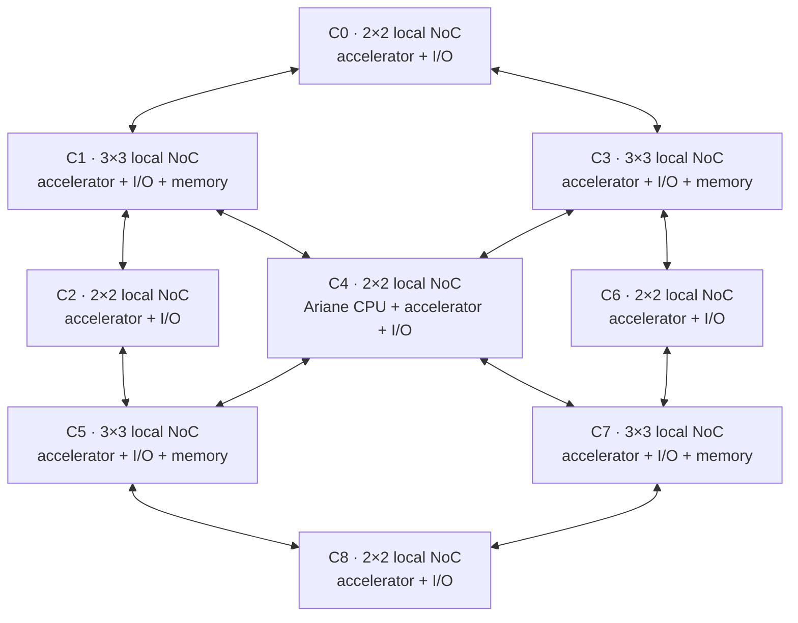
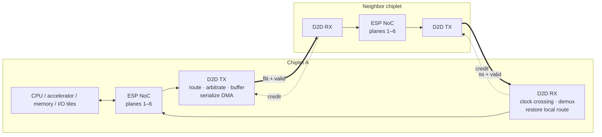

# ESP-Chiplets

ESP-Chiplets extends Columbia University's open-source ESP platform with a scalable die-to-die fabric that joins heterogeneous, tile-based SoCs into one addressable system. The project preserves ESP's six-plane network-on-chip semantics across chiplet boundaries and provides RTL simulation and multi-FPGA prototypes for unicast, multicast, DMA, and shared-memory traffic.

> **Repository status** This public repository captures an intermediate development branch. The finished codebase is available and can be provided upon request.

> **Project snapshot** 3×3 simulated chiplet mesh · 56 total tiles · four-FPGA prototype

## Public branch guide

The public branches are successive development milestones, not separate product variants. `main` is the public landing branch for the initial chiplet architecture, while the two feature branches continue the implementation toward the multi-FPGA prototype.

| Branch | Purpose |
| --- | --- |
| [`main`](https://github.com/kl3266/ESP-Chiplets/tree/main) | Common ESP-Chiplets base, portable ASIC-level D2D model, and the checked-in heterogeneous 3×3 simulation configuration described below. |
| [`bypass`](https://github.com/kl3266/ESP-Chiplets/tree/bypass) | Extends `main` with a 2×2/four-FPGA prototype, independent D2D links, bypass routing, board constraints, and XCVU19P/XCVU440 proFPGA targets. |
| [`bypass-ddr`](https://github.com/kl3266/ESP-Chiplets/tree/bypass-ddr) | Continues `bypass` with multicast-capable bypass routing, DDR-backed traffic, and the latest public four-board integration. |

The finished codebase is newer than these public snapshots and is available upon request.

## What I added

I built the chiplet-specific hardware, integration, and validation layers in this fork.

- A bidirectional D2D bridge that moves traffic from all six ESP NoC planes across north, south, east, and west chiplet links.
- Hierarchical routing metadata and lookahead routing across both local tile coordinates and global chiplet coordinates.
- Round-robin arbitration, credit-based backpressure, clock-domain crossing, per-plane buffering, and width adaptation for DMA flits.
- Parameterized chiplet wrappers and system generators for heterogeneous chiplets with different local NoC dimensions and combinations of CPU, accelerator, memory, and I/O tiles.
- ASIC simulation and proFPGA integration, including cable interfaces, board-specific constraints, clocking, DDR attachment, and parallel bitstream builds.
- Bare-metal P2P and multicast workloads that configure source/destination chip coordinates, run concurrent transfers, measure cycles, and check received data end to end.

The main implementation is under [`rtl/noc/chiplet`](rtl/noc/chiplet), with system integration in [`socs/esp_asic_chiplets`](socs/esp_asic_chiplets) and representative validation software in [`soft/common/apps/baremetal/3_by_3_chiplet_p2p_2_unicasts`](soft/common/apps/baremetal/3_by_3_chiplet_p2p_2_unicasts).

## Architecture

The checked-in simulation configuration is a heterogeneous 3×3 chiplet mesh. Every chiplet contains an accelerator and an I/O tile; the center chiplet contains the Ariane RISC-V CPU, and the four edge chiplets contain memory tiles.



Each edge bridge preserves packet identity and flow control while crossing between the ESP clock and the D2D link clock.



## Supported configurations

| Configuration | Target | Demonstrated use |
| --- | --- | --- |
| 1×1 chiplet | `main` baseline in [`esp_defconfig`](socs/esp_asic_chiplets/esp_defconfig) | Single 2×2 local NoC with CPU, accelerator, memory, and I/O tiles |
| 3×3 chiplet mesh | `main` checked-in generated configuration | Nine heterogeneous chiplets, 56 tiles, nine accelerators, four memory tiles, one CPU, and two simultaneous end-to-end P2P streams |
| 2×2 chiplet / four-FPGA mesh | [`bypass`](https://github.com/kl3266/ESP-Chiplets/tree/bypass) | One chiplet per FPGA, independent D2D links, and Xilinx XCVU19P/XCVU440 proFPGA build targets |
| 1×1, 1×2, and 2×2 traffic tests | [`bypass-ddr`](https://github.com/kl3266/ESP-Chiplets/tree/bypass-ddr) | Unicast and multicast P2P tests, D2D bypass routing, four-FPGA synthesis, and DDR-backed buffers |

`main` contains the portable ASIC-level D2D model. The multi-FPGA top levels and physical constraints are maintained on the feature branches linked above so the status of each implementation is visible rather than implied.

## Build and simulate

### Prerequisites

- Linux, GNU Make, Python 3, and a `riscv64-unknown-elf` toolchain on `PATH`.
- ModelSim/Questa for RTL simulation and a configured Xilinx Vivado installation for the Xilinx simulation libraries.
- Cadence Stratus HLS only when regenerating the dummy accelerator RTL; generated RTL is already checked in under [`tech/inferred/acc/dummy_stratus`](tech/inferred/acc/dummy_stratus).
- Hardware builds require Vivado 2018.2 and proFPGA-2021A, matching the versions expected by the inherited ESP build flow.

See the upstream [ESP setup documentation](https://www.esp.cs.columbia.edu/docs) for toolchain and environment setup.

### Run the 3×3 RTL simulation

Run the following commands from the repository root.

```bash
cd socs/esp_asic_chiplets

# Build the self-checking bare-metal workload.
make 3_by_3_chiplet_p2p_2_unicasts-baremetal

# Compile the RTL and start the simulator with that workload.
make sim \
  TEST_PROGRAM=./soft-build/ariane/baremetal/3_by_3_chiplet_p2p_2_unicasts.exe
```

At the ModelSim prompt, run `run -all`. A passing workload prints `Validation PASSED` for the checked buffers and reports zero total errors.

The committed files under `socs/esp_asic_chiplets/socgen` describe the demonstrated 3×3 topology. Running `make esp-defconfig` intentionally returns the target to the smaller 1×1 baseline, so do not regenerate the configuration before running the 3×3 example.

Use the following command to regenerate the dummy accelerator RTL before simulation.

```bash
make dummy_stratus-hls
```

### Build the four-FPGA prototype

The latest four-board flow is on `bypass-ddr`. After checking out that branch and loading the Vivado and proFPGA environments, run the following commands.

```bash
cd socs/profpga-xcvu19p-chiplets
./synth_parallel.sh 0 1 2 3
```

Use `socs/profpga-xcvu440-chiplets` instead for the XCVU440 target. The script prepares one Vivado project per board, builds the four bitstreams in parallel, and places them in the directories referenced by `profpga.cfg`; adapt that configuration to the local proFPGA connection before programming hardware.

## Validation

The checked-in representative tests use a stricter end-to-end criterion than packet arrival alone. Software initializes source buffers with deterministic tokens, launches the accelerator/DMA path, compares every destination token with its expected value, and returns a nonzero error count on any mismatch. The 3×3 workload demonstrates two concurrent transfers across the mesh from accelerator 0 to 8 and from accelerator 6 to 2. It records cycle counts in addition to data-integrity results.

This intermediate branch contains representative topology and traffic tests; the finished codebase and its complete verification suite are available upon request.

## Upstream attribution

This repository is a derivative of [Columbia University's ESP](https://github.com/sld-columbia/esp), an open-source platform for heterogeneous SoC design and FPGA prototyping. ESP supplies the original tile architecture, six-plane NoC, processor and accelerator integration, cache hierarchy, DMA and coherence services, software stack, design generators, and most of the repository's build infrastructure.

My work in this fork is the chiplet layer described above. It includes chiplet-aware packet metadata and routing, D2D TX/RX bridges, heterogeneous chiplet composition, ASIC and multi-FPGA top levels, physical-link integration, and chiplet-specific validation applications. Existing copyright and SPDX headers are retained in inherited and modified files. No authorship is claimed for upstream ESP or its third-party components.

For the complete upstream contributor list and third-party notices, see [`CREDITS.md`](CREDITS.md) and [`LICENSE`](LICENSE). The following paper provides an overview of ESP.

> Paolo Mantovani et al., “Agile SoC Development with Open ESP,” IEEE/ACM International Conference on Computer-Aided Design (ICCAD), 2020.

## Relevant source map

| Path | Purpose |
| --- | --- |
| [`rtl/noc/chiplet`](rtl/noc/chiplet) | D2D transmit/receive datapaths, arbitration, routing, and wrappers |
| [`rtl/tiles`](rtl/tiles) | Chiplet-indexed tile integration |
| [`rtl/sockets`](rtl/sockets) | NoC endpoints and chiplet-coordinate propagation |
| [`socs/esp_asic_chiplets`](socs/esp_asic_chiplets) | 3×3 topology, chiplet mesh, testbench, and ASIC/FPGA-proxy tops |
| [`soft/common/apps/baremetal/3_by_3_chiplet_p2p_2_unicasts`](soft/common/apps/baremetal/3_by_3_chiplet_p2p_2_unicasts) | Self-checking concurrent P2P validation workload |
| [`utils/flist`](utils/flist) | RTL file-list integration for the added chiplet sources |
